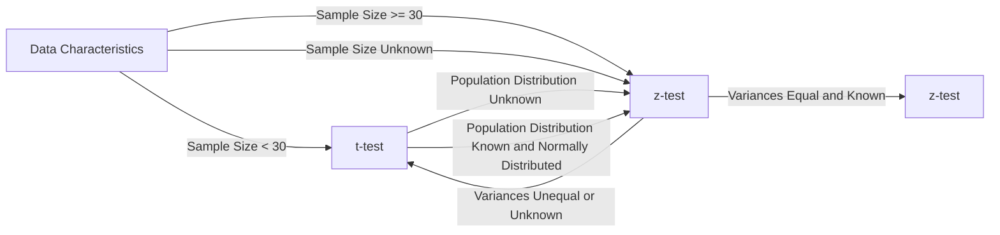

```py
# Importing the necessary packages
import numpy as np                                  # "Scientific computing"
import scipy.stats as stats                         # Statistical tests

import pandas as pd                                 # Data Frame
from pandas.api.types import CategoricalDtype

import random
import math

import matplotlib.pyplot as plt                     # Basic visualisation
from statsmodels.graphics.mosaicplot import mosaic  # Mosaic diagram
import seaborn as sns                                # Advanced data visualisation
from sklearn.linear_model import LinearRegression
import altair as alt                                # Alternative visualisation system
```

# [H1 - Samples](./H1.md)

```py
# Data inlezen (kijken welke sep dat het is, meestal ; of ,) -> default is ,
data = pd.read_csv("data.csv", sep=";")

# Data bekijken
data.head() # eerste 5 rijen

# Properties van de data bekijken
print(data.info()) # prints column names and data types

#Rows and columns
print("Rows:", len(data)) # prints number of rows
print("Columns:", len(data.columns)) # prints number of columns

# Print shape of data
print(data.shape) # prints number of rows and columns

# Print data types
print(data.dtypes) # prints data types of columns

# het aantal unieke waarden in een kolom
data["kolomnaam"].unique()

# hoeveel van elk datatype zit er in
# volledige dataset
data.dtypes.value_counts()
# per kolom
data["kolomnaam"].value_counts()

# indexen
data.index # geeft de indexen weer
data.set_index("kolomnaam", inplace=True) # zet de kolom als index
```

# Kwalitatieve variabelen

```py
# Kwalitatieve variabelen moeten omgezet worden naar een category
data["kolomnaam"] = data["kolomnaam"].astype("category")
data["kolomnaam"] = pd.to_datetime(dfemployees["kolomnaam"])
# Kwalitatieve variabelen omzetten naar een category met een bepaalde volgorde -> ordinal variable
# bv. een rating van 1 tot 5
rating_order = ["1", "2", "3", "4", "5"]
# maak een CategoricalDtype aan met de volgorde
rating_type = CategoricalDtype(categories=rating_order, ordered=True)
# zet de kolom om naar een category met de volgorde
data["kolomnaam"] = data["kolomnaam"].astype(rating_type)
# deze volgorde wordt gebruikt bij het plotten van de data
```

## Selecteren van data

```py
# Selecteren van kolommen
data["kolomnaam"] # geeft de kolom terug
data.kolomnaam # geeft de kolom terug
data[["kolomnaam1", "kolomnaam2"]] # geeft de kolommen terug in een dataframe

# Selecteren van rijen
data.iloc[0] # geeft de eerste rij terug -> tellen vanaf 0
data.iloc[0:5] # geeft de eerste 5 rijen terug -> tellen vanaf 0 -> exclusief de laatste index

# Query's
data[data["kolomnaam"] == "waarde"] # geeft alle rijen terug waar de kolomnaam de waarde heeft
#of
data.query("kolomnaam == 'waarde'")

# query's voor bepaalde kolomen
data[(data["kolomnaam1"] == "waarde1") & (data["kolomnaam2"] == "waarde2")][["kolomnaam1", "kolomnaam2"]]
```

## Droppen van data

```py
# Droppen van kolommen
data.drop("kolomnaam", axis="columns", inplace=True) # axis=1 -> kolom, axis=0 -> rij
of
data = data.drop("kolomnaam", axis="columns")

# veel lege waardes in een kolom?
data.dropna() #dropt elke rij waar er een lege waarde in zit -> niet aan te raden
data.dropna(how="all") #dropt elke rij waar alle waardes leeg zijn

# legen waardes vervangen door een waarde
data["kolomnaam"].fillna("waarde", inplace=True)
```

## Creëren van nieuwe kolommen

```py
# Creëren van nieuwe kolommen
data["nieuwecol"] = #iets van data of een berekening

# mappen van waardes
map_dict = {"waarde1": "nieuwewaarde1", "waarde2": "nieuwewaarde2"}
data["nieuwecol"] = data["kolomnaam"].map(map_dict)

# kan ook met functie
def functie(x):
    if x == "waarde1":
        return "nieuwewaarde1"
    elif x == "waarde2":
        return "nieuwewaarde2"
    else:
        return "waarde3"

data["nieuwecol"] = data["kolomnaam"].map(functie)

```
---

# [H2 - Analyse van 1 variabele](./H2.md)

## Kwalitatieve variabelen

```py
# barchart
sns.catplot(x="kolomnaam", kind="count", data=data) # count -> telt het aantal waardes per categorie
# of
sns.countplot(x="kolomnaam", data=data)

# centrality measures
data.mode() # geeft de modus terug -> meest voorkomende waarde
data["kolomnaam"].mode() # geeft de modus terug -> meest voorkomende waarde
data.describe() # geeft een overzicht van de data -> count, mean, std, min, max, 25%, 50%, 75%
```

## Kwantitatieve variabelen

```py
# histogram

# Boxplot -> geeft de 5 getallen weer -> min, 25%, 50%, 75%, max
sns.boxplot(data=data, x="kolomnaam") # x -> kolomnaam, y -> waarde
# of violinplot -> geeft de distributie weer
sns.violinplot(data=data, x="kolomnaam") # x -> kolomnaam, y -> waarde
# of kernel density plot (kde) -> geeft de distributie weer in 1 curve
sns.kdeplot(x = data["kolomnaam"])

# combineren histogram en density plot -> historgram met distributiecruve
sns.distplot(x = data["kolomnaam"], kde=True) # histogram + density plot

# centrality and dispersion measures
## Mean, st and friends
print(f"mean: {data['kolomnaam'].mean()}")
print(f"Standard deviation: {data['kolomnaam'].std()}") # Pay attention: n-1 in the denominator
print(f"Variance: {data['kolomnaam'].var()}") # Pay attention: n-1 in the denominator
print(f"skewness: {data['kolomnaam'].skew()}")
print(f"kurtosis: {data['kolomnaam'].kurtosis()}")

##median & friends
print(f"minimum: {data['kolomnaam'].min()}")
print(f"median: {data['kolomnaam'].median()}")
print(f"maximum: {data['kolomnaam'].max()}")

print(f"percentile 25%: {data['kolomnaam'].quantile(0.25)}")
print(f"percentile 50%: {data['kolomnaam'].quantile(0.5)}")
print(f"percentile 75%: {data['kolomnaam'].quantile(0.75)}")

print(f"iqr (interquartile range): {data['kolomnaam'].quantile(0.75) - data['kolomnaam'].quantile(0.25)}")
print(f"range: {data['kolomnaam'].max() - data['kolomnaam'].min()}")

# of ge zijt slim en doet
data.describe()
```

### Formule voor de standaard deviatie

```py
# BIJ SAMPLE GEBRUIK JE N - 1
# BIJ POPULATIE GEBRUIK JE N
# dit omdat je zo een betere schatting hebt van de populatie

# Bij pandas word standaard de sample gebruikt
# Bij numpy word standaard de populatie gebruikt
print(f"Pandas uses ddof=1 by default: {data['col'].std()}") # ddof -> delta degrees of freedom kun je specifiëren
print(f"Numpy  uses ddof=0 by default: {np.std(data['col'])}")

#pandas
print(f"Standard deviation population: {data['col'].std(ddof=0)}")
print(f"Standard deviation sample    : {data['col'].std()}")

#numpy
print(f"Standard deviation population: {np.std(a)}")
print(f"Standard deviation sample    : {np.std(a, ddof=1)}")
```

---

# [H3](./H3.md)

**Student $t$-distribution in Python**  
Import scipy.stats  
For a $t$-distribution with df degrees of freedom: (df = degrees of freedom)

| **Function**           | **Purpose**                                                 |
| ---------------------- | ----------------------------------------------------------- |
| stats.t.pdf(x, df=d)   | Probability density for $x$                                 |
| stats.t.cdf(x, df=d)   | Left-tail probability 𝑃(𝑋 < x)                              |
| stats.t.sf(x, df=d)    | Right-tail probability 𝑃(𝑋 > x)                             |
| stats.t.isf(1-p, df=d) | p% of observations are expected to be lower than this value |

**Normal distribution in Python**
**Python functions**

Import scipy.stats  
For a normal distribution with mean m and standard deviation s:

| **Function**                        | **Purpose**                                             |
| ----------------------------------- | ------------------------------------------------------- |
| stats.norm.pdf(x, loc=m, scale=s)   | Probability density at $x$                              |
| stats.norm.cdf(x, loc=m, scale=s)   | Left-tail probability 𝑃(𝑋 < x)                          |
| stats.norm.sf(x, loc=m, scale=s)    | Right-tail probability 𝑃(𝑋 > x)                         |
| stats.norm.isf(1-p, loc=m, scale=s) | p% of observations are expected to be lower than result |



Requirements z-test:

- Random sample
- Sample groot genoeg (n >= 30)
  - als normaal verdeeld is is sample size niet relevant
- normaal verdeeld
- populatie standaard deviatie is gekend

indien 1 van deze niet voldaan is gebruik je de t-test en deze normaal verdeeld is

## 


| **Independent**                     | **Dependent**                                           |**Test/Metric**                  |**Chapter**    |
| ----------------------------------- | ------------------------------------------------------- |------------------------------   |----------------|
| Qualitative                         | Qualitative                                             | 𝜒2-testCramér’s𝑉                |[H4](./H4.md)  |
| Qualitative                         | Quantitative                                            |two-sample𝑡-testCohen’s𝑑          |[H5](./H5.md)  |
| Quantitative                        | Quantitative                                            | — Regression, correlation        |[H6](./H6.md) |


# [H4 -> 2 kwalitatieve variabelen](./H4.md) 

H0 -> er is **geen** verband tussen de 2 variabelen 
H1 -> er is **een** verband tussen de 2 variabelen     

De Chi-kwadraattoets wordt gebruikt om associaties tussen categorische variabelen te beoordelen 

Cramér's V meet de sterkte van deze associatie

en de goodness-of-fit test controleert of de waargenomen frequenties overeenkomen met de verwachte theoretische verdeling.

---

# [H5 -> 1 kalitatieve variabele en 1 kwantitatieve variabelen](./H5.md)

Use the t-test for independence when comparing the means of two independent groups or conditions.

- 2 onafhankelijke groepen
- vergelijken van het gemiddelde van 2 groepen (niet perse even groot)
- gemiddelde van 2 verschillende groepen
- Groep met placebo en groep met medicijn

Use the paired t-test when analyzing paired or matched observations to compare means within the same group under different conditions or time points.

- 2 afhankelijke groepen
- zelfde test subjecten
- Voorbeeld zelfde auto met verschillende soorten benzine

Use Cohen's d as a measure of effect size to interpret the practical significance of the observed difference and compare effect sizes across different studies or conditions.

- Effectgrote -> hoe groot is het verschil tussen de 2 groepen

---

# [H6 -> 2 kwantitatieve variabelen](./H6.md)

dependend variable -> y
independend variable -> x

Use regression analysis when you want to understand the relationship between a dependent variable and independent variables, and predict the value of the dependent variable.

Use the correlation coefficient when you want to measure the strength and direction of the linear relationship between two variables.

- r -> 0 -> geen correlatie -> alle punten liggen verspreid
- r -> 1 -> positieve correlatie -> alle punten liggen op 1 lijn stijgend
- r -> -1 -> negatieve correlatie -> alle punten liggen op 1 lijn dalend


Use the coefficient of determination (R-squared) to assess the model fit, compare models, and interpret the proportion of variance explained by the independent variables.

- r² -> 0 -> zwakke correlatie
- r² -> 1 -> sterke correlatie

---

# [H7 -> time series](./H7.md)

- moving averages
  - simple moving average
  - weighted moving average
    - exponential moving average
- exponential smoothing
  - single exponential smoothing -> exponential smoothing
    - geen trend of seasonality
  - double exponential smoothing -> Holt's method
    - trend
  - triple exponential smoothing -> Holt-Winters method
    - trend en seasonality


